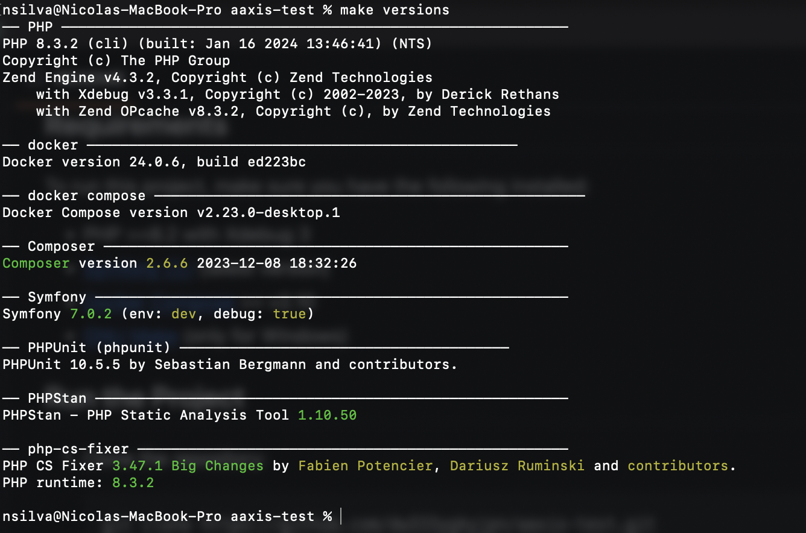
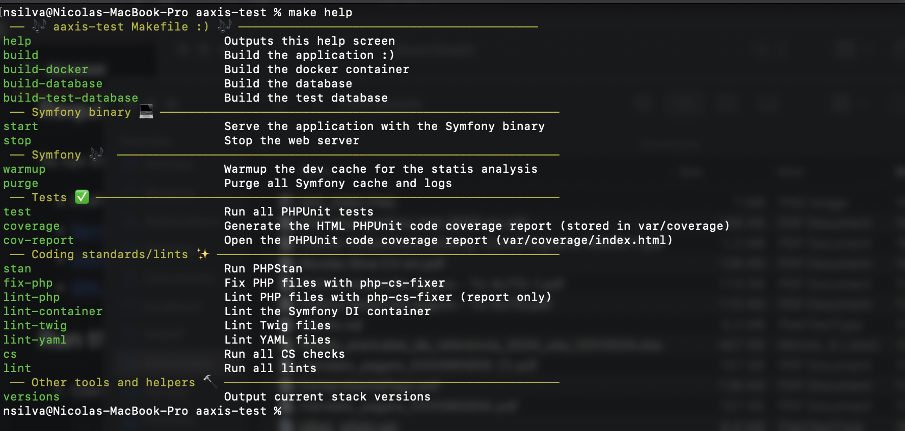
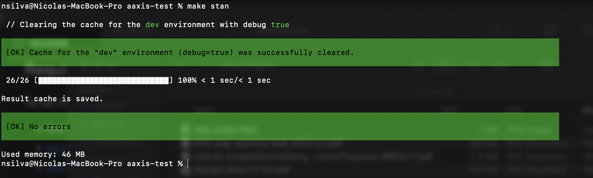
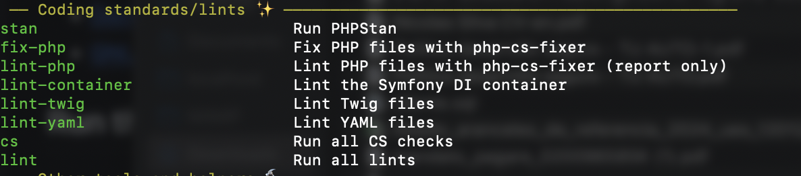

# AAXIS Symfony Test

This is a Symfony test project created for the hiring process at AAXIS.

## Technologies Used

- Symfony 7.0
- PHP >=8.2 with Xdebug 3
- PostgresQL 16-alpine
- Docker Compose
- Symfony Stimulus



## Requirements

To run this project, make sure you have the following installed:

- PHP >=8.2 with Xdebug 3
- [Symfony CLI](https://symfony.com/download) (latest version)
- [Docker Compose](https://docs.docker.com/compose/install/) >= v2.10
- [GNU Make](https://gnuwin32.sourceforge.net/packages/make.htm) (only for Windows)

## Run the Project

1. Clone the repository:

    ```bash
    git clone https://github.com/dw333ygkyjpn/aaxis-test.git
    ```

2. Check if the Symfony requirements are met:

    ```bash
    symfony check:requirements
    ```

3. Run the following command to build the application:

    ```bash
    make build
    ```

The application will be accessible at [https://localhost:8000/](https://localhost:8000/).

---

## Application overview

### POC

PS: Didnt have time to make the documentation more pretty.

### Get Token
      Endpoint: POST /api/login_check
      Description: Get a JWT token for authentication, required for all endpoints.
      Default user: aaxis
      Default password: aaxis
      Use the token in the authorization header "Authorization: Bearer {token}"
Request
```bash
curl -X POST -H "Content-Type: application/json" https://localhost/api/login_check -d '{"username":"aaxis","password":"aaxis"}'
```
Response

200:
```json
{"token":"eyJ0eXAiOiJKV1QiLCJhbGciOiJSUzI1NiJ9...."}
```

401:
```json
{"code":401,"message":"Invalid credentials."}
```

### Get Product Collection
    Endpoint: GET /api/products
    Description: Retrieve a collection of products.
Request
```bash
curl 'https://localhost:8000/api/products' -H 'Accept: application/json' -H 'Authorization: Bearer {token}'
```
Responses
```json
{
    "title": "OK!",
    "status": 200,
    "data": [
        {
            "id": 1,
            "sku": "product-sku",
            "name": "Product Name",
            "description": "Product Description",
            "createdAt": "2022-01-01T12:00:00Z",
            "updatedAt": "2022-01-01T12:00:00Z"
        },
       {
          "id": 2,
          "sku": "product-sku",
          "name": "Product Name",
          "description": "Product Description",
          "createdAt": "2022-01-01T12:00:00Z",
          "updatedAt": "2022-01-01T12:00:00Z"
       }
    ]
}
```

### Get Product
    Endpoint: GET /api/products/{sku}
    Description: Retrieve product resource.
Request
```bash
curl 'https://localhost:8000/api/products/product-sku' -H 'Accept: application/json' -H 'Authorization: Bearer {token}'
```
Response
```json
{
   "title": "OK!",
   "status": 200,
   "data": {
      "id": 1,
      "sku": "product-sku",
      "name": "Product Name",
      "description": "Product Description",
      "createdAt": "2022-01-01T12:00:00Z",
      "updatedAt": "2022-01-01T12:00:00Z"
   }
}

```

### Post Product
    Endpoint: POST /api/products
    Description: Creates product resource.
Request
```bash
curl -X POST -H "Content-Type: application/json" -d '{"sku":"new-sku","name":"New Product","description":"New Description"}' -H 'Authorization: Bearer {token}' http://localhost:8000/api/products
```
Responses:

200:
```json
{
   "title": "Resource created!",
   "status": 200,
   "data": {
      "id": 2,
      "sku": "new-sku",
      "name": "New Product",
      "description": "New Description",
      "createdAt": "2022-01-01T12:00:00Z",
      "updatedAt": "2022-01-01T12:00:00Z"
   }
}
```

### Update Product
    Endpoint: PUT /api/products
    Description: Updates a product resource.
Request
```bash
curl -X PUT -H "Content-Type: application/json" -d '{"sku":"existing-sku","name":"Updated Product","description":"Updated Description"}' -H 'Authorization: Bearer {token}' http://localhost:8000/api/products
```
Responses:

200:
```json
{
   "title": "Resource updated!",
   "status": 200,
   "data": {
      "id": 1,
      "sku": "existing-sku",
      "name": "Updated Product",
      "description": "Updated Description",
      "createdAt": "2022-01-01T12:00:00Z",
      "updatedAt": "2022-01-02T12:00:00Z"
   }
}
```

### Patch Product
    Endpoint: PATCH /api/products
    Description: Partialy updates a product resource.
Request
```bash
curl -X PATCH -H "Content-Type: application/json" -d '{"sku":"existing-sku","name":"Patched Product"}' -H 'Authorization: Bearer {token}' http://localhost:8000/api/products
```
Responses:

200:
```json
{
   "title": "Resource updated!",
   "status": 200,
   "data": {
      "id": 1,
      "sku": "existing-sku",
      "name": "Patched Product",
      "description": "same Description",
      "createdAt": "2022-01-01T12:00:00Z",
      "updatedAt": "2022-01-02T12:00:00Z"
   }
}
```

### Run batch job 
    Endpoint: PATCH|POST|PUT /api/products
    Description: Runs a batch PATCH, POST OR PUT for the resources sent on the json payload-
    follows the same structure for the corresponding action
Request
```bash
curl -X POST -H "Content-Type: application/json" -d '[{"sku":"sku-1","name":"Product 1"},{"sku":"sku-2","name":"Product 2"}]' -H 'Authorization: Bearer {token}' http://localhost:8000/api/products/batch
```
Responses:

200 Resources created:
```json
[
   {
      "id": "sku-1",
      "title": "Resource created!",
      "status": 200,
      "data": {
         "id": 32,
         "sku": "sku-1",
         "name": "Product 1",
         "description": null,
         "created_at": "2024-01-22T07:18:38+00:00",
         "updated_at": "2024-01-22T07:18:38+00:00"
      }
   },
   {
      "id": "sku-2",
      "title": "Resource created!",
      "status": 200,
      "data": {
         "id": 32,
         "sku": "sku-2",
         "name": "Product 2",
         "description": null,
         "created_at": "2024-01-22T07:18:38+00:00",
         "updated_at": "2024-01-22T07:18:38+00:00"
      }
   }
]
```

207 Multi status:
```json
[
   {
      "id": "sku-1",
      "title": "Resource created!",
      "status": 200,
      "data": {
         "id": 32,
         "sku": "sku-1",
         "name": "Product 1",
         "description": null,
         "created_at": "2024-01-22T07:18:38+00:00",
         "updated_at": "2024-01-22T07:18:38+00:00"
      }
   },
   {
      "id": "sku-1",
      "title": "Unprocessable resource",
      "status": 422,
      "violations": [
         {
            "path": "sku",
            "message": "This value is already used.",
            "invalid_value": "sku-1"
         }
      ]
   }
]
```

### Docker Setup

The Docker container is configured with Compose and includes the database and Adminer, accessible at [http://localhost:8080/](http://localhost:8080/).

### Task Runner

A Makefile script is included, providing convenient shortcuts for a better developer experience.

![Screenshot of Makefile Help]

To view available commands, run:

```bash
make help
```

### Test
You can run all the phpunit test using:

```bash
make test
```

The test are located in the `/test` folder.

The project comes with a [script](https://ocramius.github.io/blog/automated-code-coverage-check-for-github-pull-requests-with-travis/) to check the tests coverage, you can check the coverage report with:

```bash
make coverage
```

This will run the test and calculate the global code coverage by parsing and analysing the output of the Clover 
report in the clover.xml, you can see this report in HTML format running:

```bash
make cov-report
```

### Coding Standards
**You can run all the coding standards checks with:**
```bash
make cs
```

#### Static analysis
The project utilizes PHPStan to scan for any possible bugs, to execute the analysis, run:
```bash
make stan
```
The current output of the analysis:



#### CS Rules
The project utilizes PHP-cs-fixer to follow the symfony standards and some common php standards
The ruleset is defined in `.php-cs-fixer.dist.php`

#### Linting
You can check if the code follows the symfony best practices with the symfony lint commands, the make file has some
shortcuts to run these checks



`make lint` runs all the above commands

#### CI
The project has a Github workflow that runs the CS, tests and lints commands, the main branch has a rule to allow 
pull request only with these checks passed, you can see the workflow status in the [Actions](https://github.com/dw333ygkyjpn/aaxis-test/actions) page.


## Considerations

The `make build` command, specifically `make start`, will use `sudo` to run `symfony serve -d`. This is necessary for macOS and other environments where Docker environment variables are not exposed by default.

If your system exposes Docker environment variables without issues, you can remove the `sudo` command.

I used the [strangebuzz/MicroSymfony](https://github.com/strangebuzz/MicroSymfony) template to bootstrap the project, 
i decided to use this symfony skeleton template because its a fast and easy way to start a project with some 
common default libraries and scripts that modern symfony applications use
